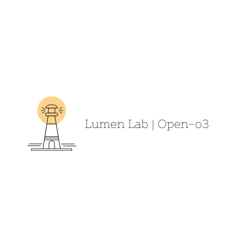

# Open-o3

> [!TIP]
> This is a framework of reasoning, not a model. You can use the framework on any LLM.



[Blog](https://yuka.living/2025/02/26/open-o3-a-framework-for-exponentially-improving-llm-accuracy-through-systematic-resampling/)

  

Open-o3 is the open-source version of OpenAI's o3. This project aims to provide a powerful, open, and accessible language model for researchers and developers, advancing the field of artificial intelligence. Open-o3 is committed to offering flexible and customizable interfaces to support various reasoning tasks such as numerical calculations, programming, logic reasoning, etc. Through this open-source project, we hope to foster innovation and application of AI technology.

## Project Description

Open-o3 is an efficient and scalable language model, which is an open-source reproduction of OpenAI's o3 model. Our goal is to provide developers and researchers with a reliable and easy-to-use tool to help them implement and explore smarter and more complex natural language processing applications.

## Usage Example

```python
    system_prompt = "You are a large reasoning model Open-o3 developed by Lumen Lab."
    reasoner = o3(system_prompt=system_prompt, enable_tda=True, save_results=True)   
    reasoner.run_example()
```

## Development and Contribution

We welcome contributions in any form, whether it's reporting bugs or submitting new features. To contribute, you can:

1. Create a new issue to report a problem or suggest a new feature.
2. Fork the repository and develop new features or fix bugs on your own branch.
3. Submit a pull request.

## License

This project is licensed under the MIT License, allowing you to freely use, modify, and distribute the code. For more details, please refer to the [LICENSE](LICENSE) file.

## Contact Information

If you have any questions, suggestions, or feedback, feel free to contact us via the following methods:

- Email: [yuka@lumenlab.cc](mailto:yuka@lumenlab.cc)
- GitHub Issues: [https://github.com/ChihayaYuka/Open-o3](https://github.com/ChihayaYuka/Open-o3)
